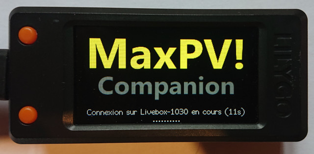
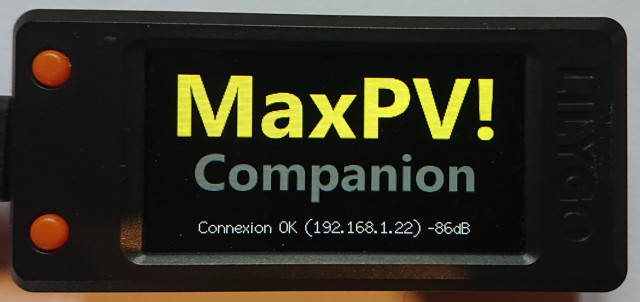
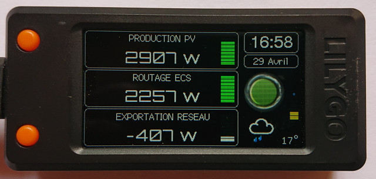
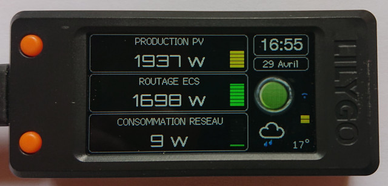
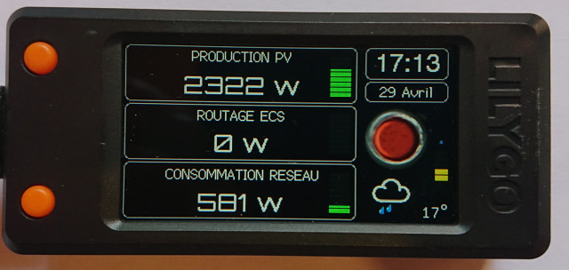
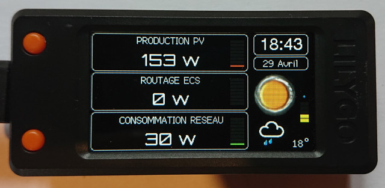
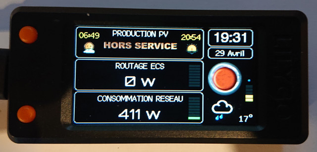
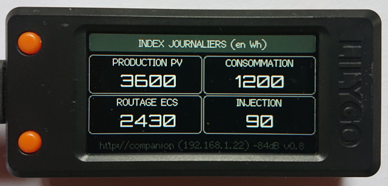

# Companion for MaxPV!

"Companion" est un écran déporté et autonome pour l'affichage des informations du routeur solaire MaxPV!

L'afficheur utilise un simple LILYGO T-Display S3 qui se connecte à votre réseau local. Il n'est donc pas nécessaire d'avoir une installation domotique pour fonctionner.

Les données affichées sont les suivantes : 
- production photovoltaiques, 
- énergie routée vers le cumulus, 
- la consommation électrique du domicile, 
- la quantité d'énergie exportée
  
Ainsi que :
- les informations météo locales
- l'heure et la date locale
  
En option :
- température du cumulus, si vous avez une sonde

## Liens
Forum d'échange sur Conpanion : https://forum-photovoltaique.fr/viewtopic.php?f=110&t=62730

Repository de "MaxPV!" :  https://github.com/Jetblack31/MaxPV

 ## L'afficheur en images

# Installation

Se référer au manuel "Installation.pdf" disponible à l'adresse :
 - https://github.com/JJHontebeyrie/Companion/blob/main/Installation.pdf (utiliser le bouton "Download" si le document ne s'affiche pas directement)

De nombreuses bibliothèques sont à installer dans le répertoire "librairies"

Décompresser l'archive ZIP de Companion dans le répertoire des croquis d'ArduinoIDE.
Par exemple dans "D:\Documents\Arduino\" vous devez avoir une arborescence de répertoires du type : 
 - "D:\Documents\Arduino\Companion_4_MaxPV-main\Companion\"
dans laquelle se trouvent les fichiers "Companion.ino" et les autres fichiers ".h" 
 
Depuis l'Arduino IDE, ouvrir "Fichier > Carnet de croquis > Companion_4_MaxPV-main > Companion"

Sélectionnez la carte "LilyGo T-Display-S3" et le port associé.

S'assurer que **"Outils > USB CDC On Boot"** est à **"Disabled"** car sinon le démarrage ne sera pas possible tant que l'écran "Moniteur série" n'est pas ouvert...

Lancer le téléversement.

L'opération de compilation dure environ 1 min car il y a pas mal de bibliothèques à compiler...

L'installation se termine avec les messages "Writing 100%" et "Hard reseting"

# Crédits

L'afficheur est basé sur "Campanion MSunPV" 2.50 de @jjhontebeyrie (https://github.com/JJHontebeyrie/Companion)

# Versions

## version 0.10 (10/05/2023)

- Correction de l'affichage du niveau de batterie
- Le voyant représente une réserve d'énergie :
	- si importation, alors rouge
	- si réserve jusqu'à 200w, alors orange
	- si réserve jusqu'à 1000w, alors jaune
	- si réserve jusqu'à 2000w, alors vert
	- si plus, alors turquoise
	- en fonction de chaque statut, si exportation d'énergie alors un logo supplémentaire apparait sur le voyant
- Affichage de la valeur de la réserve sur le voyant en kW
- Modification du mode de défilement des écrans par l'appui du bouton bas (Suppression du retour automatique vers l'écran principal)
- Ajout écran "Réserve d'énergie" / "Consommation" : l'objectif est de pouvoir visualiser de loin l'énergie disponible, ou la consommation actuelle
- Augmentation du timeout avant reboot à 20s

## Version 0.9 (03/05/2023)

- Basée sur la version 2.50 de Companion "MSunPV" https://github.com/JJHontebeyrie/Companion

- Adaptation pour la lecture des données de puissance de MaxPV et de quelques paramètres
- Ajout possibilité d'accéder à la température de l'ECS via une API autre que MaxPV (testé avec Jeedom et Shelly 1P)
- Refonte écran de démarrage pour MaxPV!
	- Nouveau logo
	- Indications de connexion avec compte à rebours avant redémarrage auto
- Mise à jour écran principal :
	- Réactualisation des icônes
	- Ajout taux d'humidité
	- Amélioration lisibilité qualité du signal WiFi
	- Suppression de l'indicateur de luminosité
	- Ajout indicateur de rafraichissement des données (en haut à gauche)
	- Amélioration finesse des jauges
	- Jauge d'injection : affichage du taux injecté par rapport à la production courante
- Ecran en surimpression, dédié à la gestion de la luminosité
- Refonte indicateur des cumuls journaliers
	- Ajout d'information techniques (IP + force signal + version)
	- Ajout séparateur de milliers pour meilleure lisibilité

